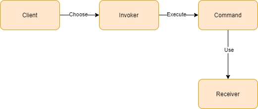

# Design Patterns: Command

It is a behavioral project pattern that transform a order to an independent object that contains all the necessary information.

## Characteristics
* **Command**: The own command, that contains the instructions and references.
* **Receiver**: The thing that the command will execute.
* **Invoker**: Responsible to execute the commands.
* **Client**: The beginning of all. It decides what command will execute.



An important observation is that the command has all the data to process the request.

## Hands-on
I will not do specifics implementations like *ClientRepository*. Instead of this, I will just use the interface.


### Commands Implementation
First we need to create the interface ICommand, which will contain all the methods that we will need:
```rb
public interface ICommand
{
    void Execute();

    bool CanExecute();

    void Undo();
}
```
Note that we have three methods:
* **Execute()**: to execute, in fact, the command
* **CanExecute()**: some condition that we consider necessary to execute the command
* **Undo()**: like rollback to the command

Next, let's create a *Command Manager*, it will responsible to invoke all the commands that we will pass for it:
```rb
public class CommandManager
{
    private Stack<ICommand> commands = new Stack<ICommand>();

    public void Invoke(ICommand command)
    {
        if (command.CanExecute())
        {
            commands.Push(command);
            command.Execute();
        }
    }

    public void Undo()
    {
        while(commands.Count > 0)
        {
            var command = commands.Pop();
            command.Undo();
        }
    }
}
```

And finally, a specific command:
```rb
public class AddClientCommand : ICommand
{
    private readonly IClientRepository _clientRepository;
    private readonly Client _client;

    public AddClientCommand(IClientRepository clientRepository, Client client) =>
    	(_clientRepository, _client) = (clientRepository, client);

    public bool CanExecute()
    {
        if (_client == null)
        	return false;

        return _clientRepository.GetClient(_client.Id) == null;
    }

    public void Execute()
    {
        if (_client == null)
        	return;

        _clientRepository.Add(_client);
    }

    public void Undo()
    {
        if (_client == null)
        	return;

        _clientRepository.Remove(_client.Id);
    }
}
```

Well, this command is responsible to insert/create a client in our data store, like its name already show. Let's analyze this code:
1. We receive, by constructor, all we need:
	1. The repository (*IClientRepository*), that we use to do some operation in the datastore
	2. And the Client object that we will use to do something
2. The **CanExecute()** method: we inform that the condition to create a client is if this client does not exists.
3. The **Execute()** method: we just verify if the client object is not null and create it.
4. The **Undo()** method: it is a rollback method. So, in this case, we just exclude that client we created.


### The execution

We pass the responsibility to create the client for another part of our project, let's see how can we call the commands for this:

```rb
class Program
{
    static void Main(string[] args)
    {
        IClientRepository clientRepository = default;
        Client client = default;

        var addClientCommand = new AddClientCommand(clientRepository, client);

        var manager = new CommandManager();
        manager.Invoke(addClientCommand);

        // ... do something

        manager.Undo();
    }
}
```
* First, we instantiate our *Client Command*, passing the repository and the object.
* The **AddClientCommand** is of the ICommand type, so we can pass it to our **CommandManager**, to execute the command.
* Finally, if we need to undo our process we can call the Undo() method, of the **CommandManager**

#### Case Study 🤔
This is very useful too if we work with an online store. For example, in the online store we can add many items to a cart, right? So, we can make many commands to do the add item in cart operation. And, if in a moment we can empty this cart, we just call the Undo method.

#### Curiosity ℹ
The ICommand interface, that we built, already exists natively. You just call the System.Windows.Input. You can use it too

## Conclusion
* Allow you to make a separate responsibilities.
* Make your application more robust.
* Pay attention for you do not to put unnecessary complexity.

---

### References
* [Pluralsight - C# Design Patterns: Command](https://app.pluralsight.com/library/courses/c-sharp-command-pattern/table-of-contents)
* [Refactoring Guru - Design Pattern Command](https://refactoring.guru/pt-br/design-patterns/command)